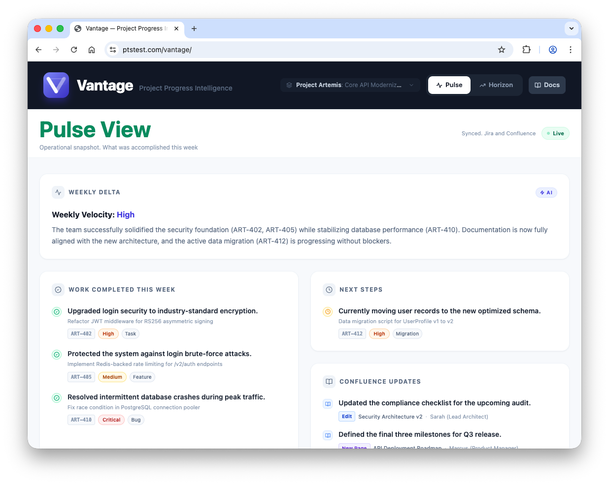
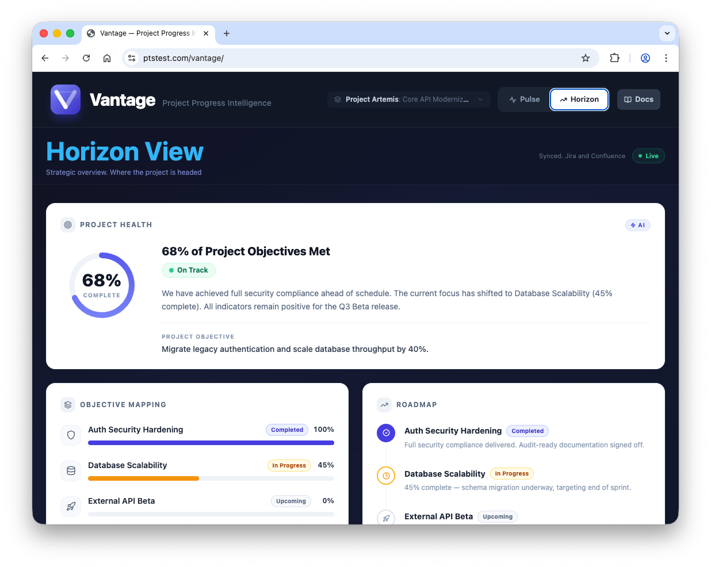
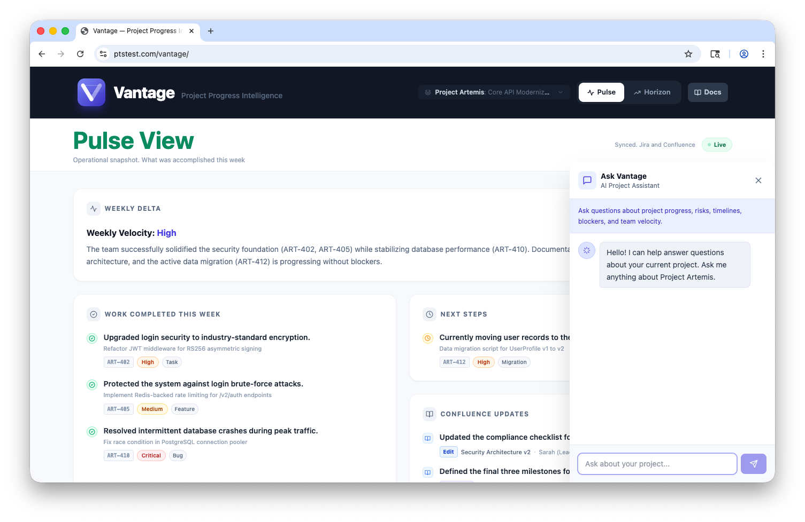
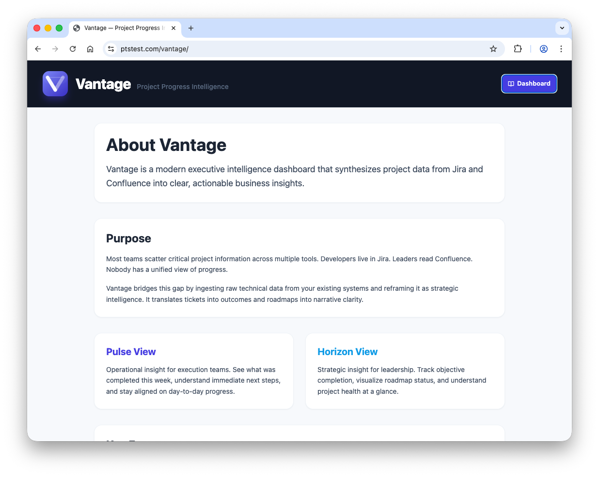

# Vantage: Executive Intelligence for Development Teams

## The Problem
Most teams scatter critical project information across __Jira__, __Confluence__, and dozens of other tools. Developers live in tickets. Leaders read documentation. Getting a unified view of progress take a lot of effort. Project managers spend hours translating the technical work currently done into business outcomes for stakeholders.

## The Solution
Vantage is an AI-powered dashboard that synthesizes project data from Jira and Confluence into clear, actionable business insights. It automatically translates technical work into executive-ready intelligence.

Please find a **3-minute video walkthrough** here: https://pfizer-my.sharepoint.com/:v:/g/personal/balabm_pfizer_com1/IQD46uWTYEA0RIPFTxBed2mlAfYbFEQkLbffq973Dbw8tg0?e=d0TOA8

Please find a working **click-prototype** here: https://ptstest.com/vantage/

Please find the **GitHub repository** of the click-prototype here: https://github.com/mbalabanov/vantage

### Two Views. One Platform
- **Pulse View**: Operational snapshot for execution teams. See what shipped this week, what's in progress, and what's next.

 - Operational snapshot for execution teams. See what shipped this week, what's in progress, and what's next.

- **Horizon View**: Strategic overview for leadership. Track objectives, visualize roadmaps, and understand project health at a glance.

 - Strategic overview for leadership. Track objectives, visualize roadmaps, and understand project health at a glance.

## Key Features
- **AI-Powered Summaries**: Technical tickets become business outcomes automatically
- **Conversational AI Assistant**: Ask questions about your project in natural language via the floating chat interface. Get instant answers about progress, risks, timelines, and blockers based on live project data
- **Unified Data Stream**: Jira and Confluence updates appear together in context
- **Non-Disruptive**: Reads from existing tools. No data entry, no new systems
- **Executive-Ready Design**: Built for high-level leadership suite consumption and presentation-ready screenshots
- **Real-Time Intelligence**: Always synced, always current

 - AI chat that allows users to ask anything about the project.

### Use Cases
- Standup briefings and sprint planning
- Stakeholder updates without extra work
- Investor pitches with live project health
- Cross-functional alignment across engineering, product, and leadership

## Seamless Integration
Vantage connects directly to the existing Atlassian ecosystem using secure service accounts. Once configured, it pulls data in real-time from Jira tickets, sprints, and epics, as well as Confluence pages and updates. No manual exports or  middleware needed. The team continues working in the tools they already use, while Vantage aggregates everything into a unified intelligence layer. Setup takes minutes, and the data never leaves Atlassian environment without explicit authorization.

## The Result:
Vantage turns scattered project data into strategic clarity. Give every stakeholder the view they need. Provide better alignment faster.
 - The Documentation Page
